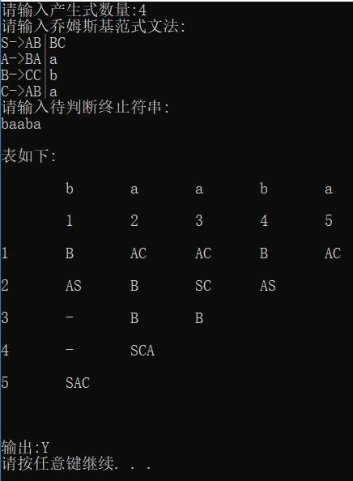
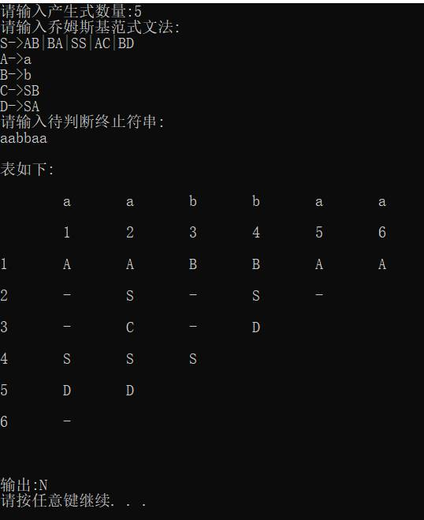

# CYK-algorithm

C++  implementation of the *CYK* algorithm

## 实验题目

用你所熟悉的程序设计语言(如C)编一程序,在计算机上实现CYK算法。

输入:(1)乔姆斯基范式文法G

​     (2)一个终结符串x

输出:若x∈L(G),则输出“Y”;若x∉L(G),则输出“N”   


## CYK算法伪代码

```
CYK算法

{

(1) for i=1 to n do

(2)    Vi1={A|A→a是G中的产生式,a是x的第i个符号}

(3) for j=2 to n do

(4)   for i=1 to n-j+1 do

   {  

(5)     Vij=∅

(6)     for k=1 to j-1 do

(7)     Vij = Vij∪ {A|A→BC是G中的产生式，且B∈Vik,C∈Vi+k,j-k}

​        }

}

说明:以上CYK算法伪代码采用《形式语言与自动机》陈有祺著 P145版本，Vij表也采用教材中所表示
```

 

 

 

 

## 算法时间复杂度分析

从第二章中伪代码可以看出,从(1)到(2)是一个单循环,处理j=1的情况,作为下面计算的基础。从(3) 到(7)是一个三重循环,处理j从2~n的情况。这个三重循环每个重复次数均不超过n,第(7)行虽然复杂，但也只需常数时间,所以CYK算法的时间复杂度为O(n3)

> (注:上文中的n为终结符串x的长度|x|)


## 测试样例

**测试样例(1):**

样例来源:    教材P145 

乔姆斯基范式文法：

S->AB|BC     A->BA|a

B->CC|b      C->AB|a 

终结符串:x=baaba

 

**测试样例(2):**

样例来源:    教材P147 8.4 

乔姆斯基范式文法：

S->AB|BA|SS|AC|BD

A->a    B->b

C->SB   D->SA    

终结符串:x=aabbaa

 

## 程序操作步骤

(1)     输入产生式数量  (类似于S→AB|a数量算1)

(2)     输入乔姆斯基范式文法(每行输入一个，输入完回车)

(3)     输入待判断终止符串

(4)     等待算法输出

(5)     输出结果为:格式同教材P145表,结论

 

**测试样例(1)运行结果:**

 




 

**结果分析:在V15中出现起始符S,所以x∈L(G)**

 

 

 

**测试样例(2)运行结果:**

 



 

**结果分析:在V16中未出现起始符S,所以x∉L(G)**